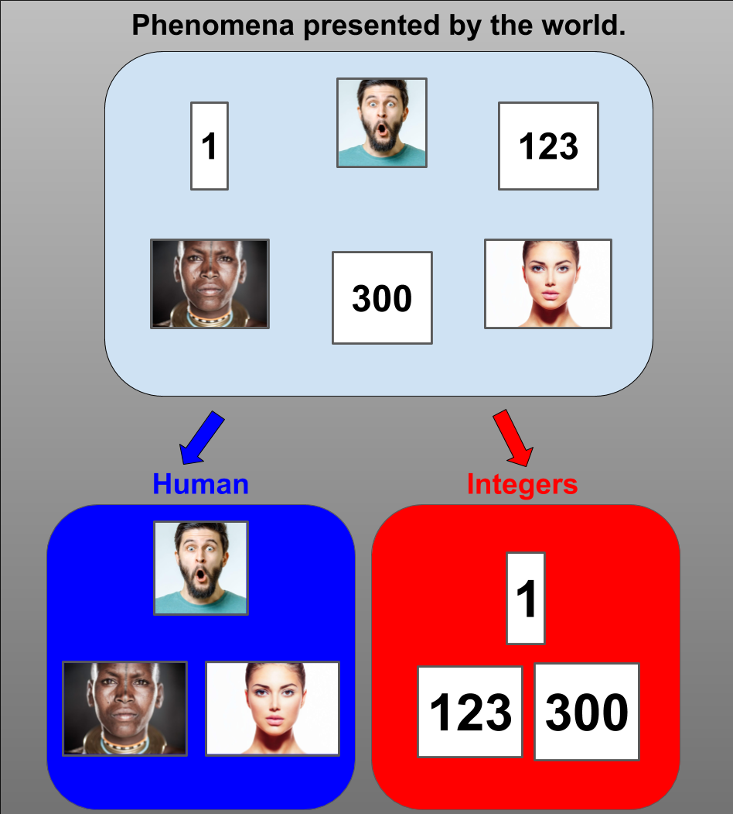

# Categories and Thought - Work in progress
#### Andrew Ribeiro 
#### August 2020

The world is full of many *things* mixed up together. A fundamental application of our minds to the problem of comprehending the world is separating things into groups, i.e., *categories*. In this essay, I explore the philosophical concept of categories and how it relates to the nature of thought.  

## Section 1: Organizing Phenomena

The world appears to contain many things.

In recognition of the perceptual layer between us and the world that contains the *things-in-themselves*, the presentations of appearances in the world are called *phenomena*, i.e., objects of our experience.  

<u><b>(Definition 1) <i>Phenomenon</i>:</b></u> In *"Critique of Pure Reason,"* Kant describes *phenomena* to be: "appearances to the extent that as objects they are thought in accordance with the unity of the categories." 

Phenomena seem to be related to other phenomena. One of the fundamental mental operations we can perform on phenomena is their separation into groups. The simplest relationship between phenomena is the groups they mutually belong to, i.e., their mutual classifications. 

<u><b>(Definition 2) <i>Class</i>:</b></u> A named grouping of phenomena.   

I say classes are "groupings" instead of "groups" to emphasize that the *substance* of classes is the rules by which phenomena are identified as instances of classes, i.e., the mechanisms of *classification*. 

<figure class="image">
  
  <figcaption>Figure 1: Classification of phenomena.</figcaption>  
</figure>

How can we discriminate between humans and integers? Note that we are using the *class* name of phenomena, which means this question asks how we discriminate between the grouping mechanism of the human and integer classes. In other words, this is not a question of how the visual representations of humans and integers are discriminated, i.e., image classification. 

<figure class="image">
  
  <figcaption>Figure 2: Discrimination of humans versus integers.</figcaption>  
</figure>

The simplest way of discriminating between two classes is to ask what can be said about one class that cannot be said about the other. 

<u><b>(Definition 3) <i>Category</i>:</b></u> *Categories* are the largest mutually exclusive classes.

The ten classic Aristotelian categories of things which supposedly have no overlap, i.e., the things in each category are *contained* by that category, i.e., no thing exists in more than one of the categories. 

When we look at a person, their appearance causes us to think of them as "humans," i.e., we experience them as an instance of the human class.  

