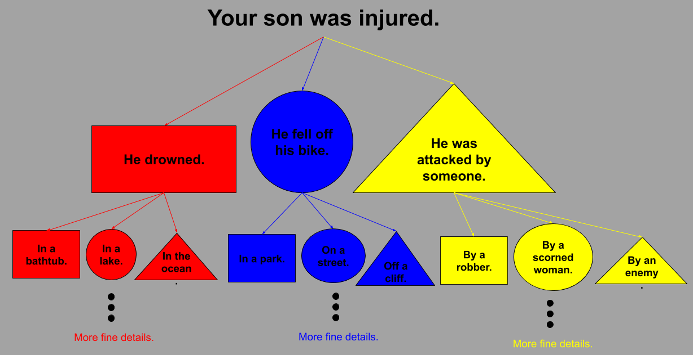
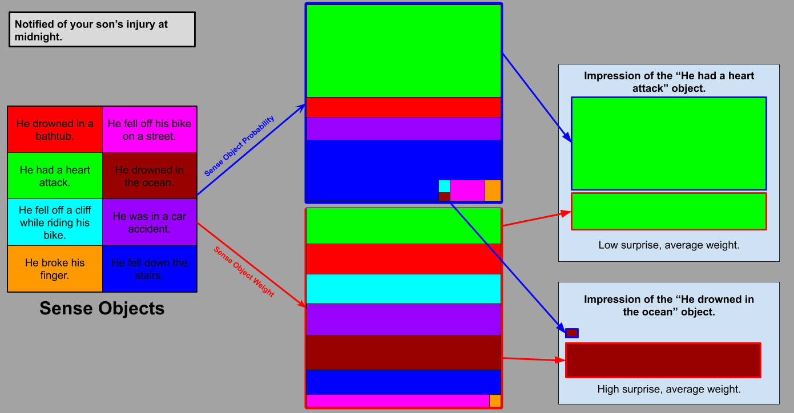

# Sense and Truth - WORK IN PROGRESS 
#### Andrew Ribeiro 
#### May 2020

> Suppose Professor Hardy came to me and said, "Wittgenstein, I've made a great discovery. I've found that..." I would say, "I am not a mathematician, and therefore I won't be surprised at what you say. For **I cannot know what you mean until I know how you've found it.**" We have no right to be surprised at what he tells us. For although he speaks English, yet the meaning of what he says depends upon what he says depends upon the calculations he has made. 
>
>-Wittgenstein's Lectures on The Foundations of Mathematics (Cambridge 1939)

In some sense of the word, we may say that *truth* is simply what is the case. To *know* what is the case, i.e., the state of the world, do we not also need to know *how* something is the case? For example, if I said to you "I am sick," you would need to know what sickness I have in order to understand the truth of my words, i.e., the state of affairs which make "I am sick" true. The set of circumstances which make a proposition true is the *sense* of a proposition. In the case of "I am sick," its sense is the set of all sicknesses. In this essay, I further examine the relation between truth and sense. 

## Sense and Object

## The Midnight Call
Your phone rings in the middle of the night. You are startled awake and pick up the phone. It's a doctor from your local hospital: **A**="Your son has been injured.", he says. You have no reason to believe the doctor is an impostor or lying and so your emotions begin to swirl as your mind fluctuates over various probability assignments to different types of circumstances which may make **A** true: did he drown, did he fall off his bike, was he attacked by someone, etc. 

<figure class="image">
  
  <figcaption>Figure 1: An incomplete <i>shape</i>, i.e., <i>sense</i>, of proposition <b>A</b> discussed above. </figcaption>  
</figure>

As depicted in figure 1, the truth of a proposition alone does not necessarily imply a singular state of affairs. On the contrary, it delimits a *space of affairs*, which we may call the *sense* of a proposition. 

If the doctor in the phone call above continued to speak and told you that your son's finger was broken by him slamming the fridge door on it while retrieving items for a midnight snack, the *impression* that this *particular* injury would make on you is relative to all other objects contained in the sense of being notified that your son was injured in the middle of the night. Namely, you would be relieved and would most likely find the situation comical because being notified of such an injury at midnight is somewhat absurd when contrasted with the other objects contained in the sense of being notified of an injury at midnight -- like having a heart attack.

Naturally, the context of a proposition augments its sense. Being notified of your son being injured in the middle of the night has a much *graver* sense than being notified in the middle of the day. Even though they have a similar *coverage* of objects they contain, i.e., the time of day does not *cause* certain types of injuries, the *probability* of each object making the proposition true is different; for example, it is more likely to be notified in the middle of the night that your son has suffered a heart attack or some domestic injury, as opposed to being notified that he was attacked while walking the streets, which is unusual behavior for most people. 

<figure class="image">
  
  <figcaption>Figure 2: The sense and impressions of getting notified of your son's injury at midnight.
</figure>

*Figure 2* is an incomplete picture of the sense and impressions of being notified at midnight that your son has been injured. Eight particular circumstances which make the proposition "Your son has been injured." true, which we may call *sense objects*, are taken to cover the *entire* sense of the proposition. This is obviously not a realistic rendering, but it is enough to provide a simple model for discussion. Each sense object is projected into two domains: the probability domain and the weight domain. Each domain can be considered to be a probability distribution, i.e., the real number assigned to all events in the domain sum to one. This is depicted by a fixed sized rectangle which is divided up between the probability, or weight, of each event. The weight of having a heart attack, drowning in a bathtub, falling off a cliff, etc., are all the same because they indicate the death of your son; however, their probabilities are different. Therefore, even though the weight of your son drowning or him having a heart attack may be the same, in the sense that they both signify his death, the *impression* they make on you within the context of being notified of him being injured at midnight is different because the probability of each sense object is vastly different. I should perhaps note that the particular weight and probabilities depicted in *figure 2* are obviously not fixed as I have portrayed them: each individual has their own probability map and weight map of sense objects contained by the sense of any given proposition which informs their impression of sense objects.   

## The Chess Game