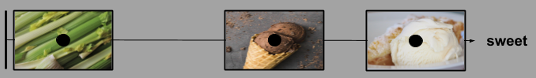
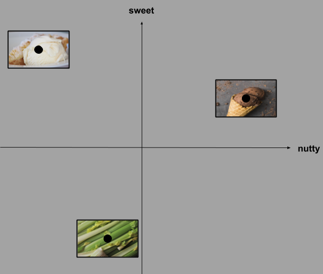
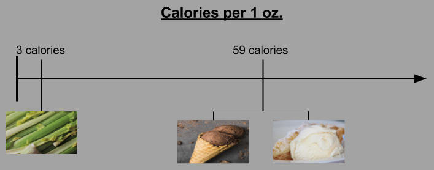
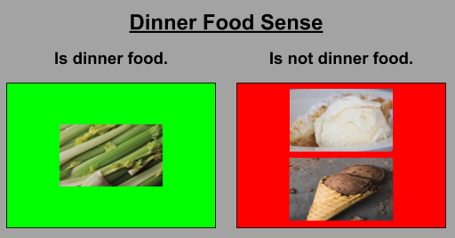
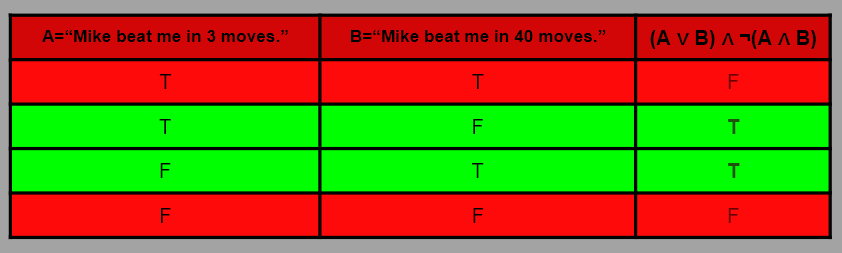
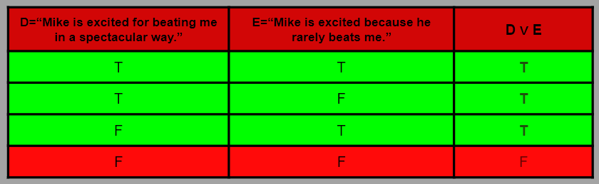
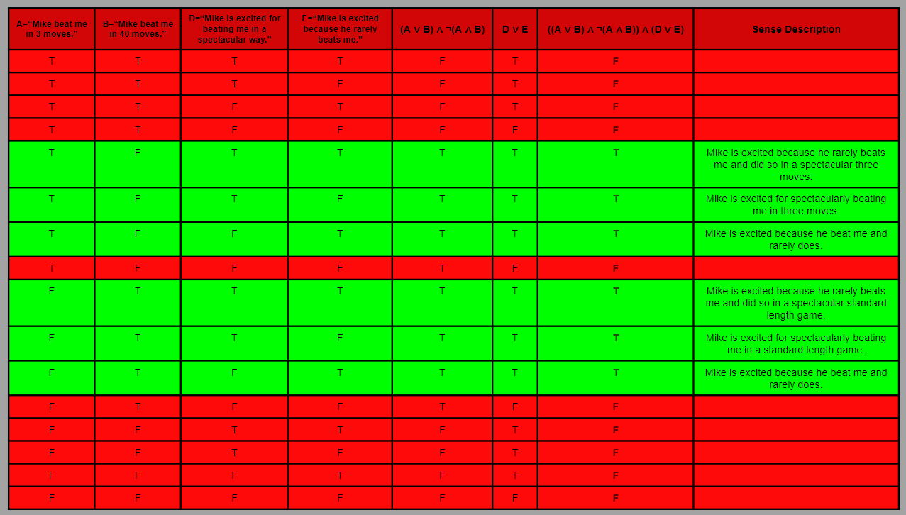

# Sense and Truth - WORK IN PROGRESS 
#### Andrew Ribeiro 
#### May 2020

> Suppose Professor Hardy came to me and said, "Wittgenstein, I've made a great discovery. I've found that..." I would say, "I am not a mathematician, and therefore I won't be surprised at what you say. For **I cannot know what you mean until I know how you've found it.**" We have no right to be surprised at what he tells us. For although he speaks English, yet the meaning of what he says depends upon what he says depends upon the calculations he has made. 
>
>-Wittgenstein's Lectures on The Foundations of Mathematics (Cambridge 1939)

In some sense of the word, we may say that *truth* is simply what is the case. To *know* what is the case, i.e., the state of the world, we must also know *how* something is the case. For example, if I said to you "I am sick," you would need to know what sickness I have in order to understand what my words *mean*, i.e., the state of affairs which make "I am sick" true. The set of circumstances which make a proposition true is the *sense* of a proposition. A particular circumstance belonging to a sense is a *sense-object*. The sense of the proposition "I am sick." is the set of all possible sicknesses. "I have the flu." is an example of a sense-object belonging to the sense of the proposition "I am sick." 

The *impression* of a sense-object, i.e., the *phenomenological representation* of a sense-object, is relative to all objects contained by the sense it belongs to. For example, "I have cancer." and "I have the flu." are both sense-objects belonging to the sense of the proposition "I am sick." Thus, the fact that we could have cancer *dampens* the impression of having the flu because cancer expands the scale of sickness and makes the flu appear to be a rather minor illness by comparison. 

Of course, every proposition belongs to a context which *augments* its sense. If "I am sick." is said by a 90-year-old woman, then "I have the flu." and "I have cancer." may have the same impression, i.e., the signification of imminent death. 

I am of the opinion that *truth* has deleteriously overshadowed the significance of *sense* throughout much philosophical discourse. Many philosophers have waged countless battles over *the* truth, but in many cases, they were actually clashing over their *sense* of the truth. Can much of philosophy be reduced to an affirmation of the fact that the appearance of an object is a function of one's orientation to it? 

In this essay, I will further examine the relation between sense and truth. 

*Before I go on, I should note that I do not attempt to rigorously prove anything in this essay. It is a brisk examination some themes of sense and truth which seem interesting -- a sketch, if you will. Thus, one should not pay too much attention to the details I provide and focus rather on the shape of the themes I address.*

## Sense, Space, Object, and Reason
> All our knowledge begins with the senses, proceeds then to the understanding, and ends with reason. There is nothing higher than reason. 
>
>-Immanuel Kant

Our five basic senses are like sensors which allow us to detect objects in different spaces; for example, when we smell something, we detect a particular *scent object* in the *space of scents*. Scent objects do not exist in the same space as *tactile objects*, so it is strictly nonsensical to ask something like "How does the smell of chocolate compare with a gentle stroke across your cheek?", but it is perfectly sensible to ask something like "How does the smell of chocolate compare with the smell of vanilla?" 

When comparing objects within the same sensory space, i.e., sense, we must represent them as coordinates with respect to particular *axes* defined by *organizing principles* in that sense. For example, in the sense of hearing, we can construct an axis defined by the organizing principle of "similarity to the sound of a police siren." 

<figure class="image">
  
  <figcaption>Figure 1: Three sound objects on an axis in the space of sound.</figcaption>  
</figure>

We may also use more *abstract* organizing principles to construct *sense axes*. For example, "sweet" is a word we use to describe certain types of scents. "Sweet" is not a sense-object like "police siren" is in the example above, but rather it is an abstract property derived from our visceral reaction to certain types of scents, i.e., we *feel* a certain way when we smell sweet scents and thus say all things that invoke this feeling "smell sweet." As we did above, we may also *embed* scent objects in a 1D space of sweet scents. 

<figure class="image">
  
  <figcaption>Figure 2: An embedding of three scent objects in the 1D sweet scents space.</figcaption>  
</figure>

In *figure 2*, we have *embedded* three scent objects in the 1D sweet scents space, namely: celery, chocolate, and vanilla. I am unacquainted with the science of scent, so my embedding should not be considered rigorous or objective; what I provide here is purely for the sake of discussion. To my nose, celery does not smell sweet at all and vanilla smells sweeter than chocolate. We may now increase the dimensionality of the embedding space by adding another axis. We will choose the "nutty" smell for this purpose.  

<figure class="image">
  
  <figcaption>Figure 3: An embedding of three scent objects in the 2D sweet-nutty scent space.</figcaption>  
</figure>

When we embed objects in a space, we reason about where each object is placed with respect to the other objects in the embedding. To make the embedding depicted by *figure 3*, I started off by placing chocolate and vanilla where I thought they should be, then I began reasoning about where to place celery. I associate nutty with moderate dark smells like wood and chocolate, thus light floral smells would be the opposite of nutty. Therefore, celery should be closer to vanilla than chocolate on the nutty axis, but how much closer? Celery has a somewhat earthy smell, so it shouldn't be right next to vanilla, but perhaps somewhere between chocolate and vanilla. Again, my embeddings are subjective and I am merely providing my reasoning to illustrate the *proximity reasoning* one performs when embedding objects in a space. 

The objects I have chosen above to represent scents are not *pure* in the sense that they are not disembodied scent objects: the vanilla ice cream, the celery sticks, and the chocolate ice cream can each be projected into other senses, i.e., we can touch, see, feel, smell, and hear these objects. The basis of how we identity these objects is how they stand in relation to our senses. If we lick the chocolate ice cream and find that it has the texture of stone, we would feel deceived in the sense of texture; if we take a bite of the celery stick and find that it makes a soft wet sound, like biting into ice cream, yet feels stiff as it should, we would feel deceived in the sense of hearing; if we lick the chocolate ice cream and it tastes like vanilla, we would be deceived in the sense of taste; and so on.

How an object stands in relation to our senses is only *the beginning* of an object's life in our minds. For example, if we eat one hundred pounds of ice cream and feel as if we ate nothing, we would feel deceived in the *sense of reason*. Given that on average a pound of ice cream is one thousand calories, one hundred pounds of ice cream would be enough calories to sustain a man for forty days or so. Thus, eating so much ice cream must cause an effect or we misunderstand the objects under consideration! Eating ice cream before dinner may also irritate our reason in a different way; namely, our sense of nutritional etiquette. Reason can be said to be a type of *super sense*. With reason, we can create *senses*, i.e., spaces in which we can represent and reason about objects beyond the elementary domains of our basic senses.

In the case of food, we may use reason to construct the *caloric sense*. Just like we embedded objects above in the space of scent and sound, we can do the same for calories. 

<figure class="image">
  
  <figcaption>Figure 4: Three food objects embedded in the 1D calories per 1 oz space.</figcaption>  
</figure>

Likewise, we can also use reason to construct the *dinner food sense*.

<figure class="image">
  
  <figcaption>Figure 5: Three food objects embedded in the dinner food sense.</figcaption>  
</figure>

We use reason to construct senses, i.e., spaces, and objects, i.e., named regions of space. No object can be spoken of without speaking of the space that contains it. Attempting to extract objects from the spaces that contain them produces nonsense. As an example, suppose we are given the following statements: 

- $C = $ "I have consumed 2,500 calories today. I have therefore met the average daily caloric intake recommendation."
- $D = $ "I have consumed 1,500 calories today. I have therefore not met the average daily caloric intake recommendation."
- $B = $ "I eat a 150 calorie ice cream cone as a snack."  

$C$ and $D$ are spaces that can contain the object $B$. If $B$ is contained by $C$, then it is an object of overindulgence in the *caloric sense*. On the other hand, if $B$ is contained by $D$, then it is not an object of overindulgence in the *caloric sense*, but may be one in the *nutritional sense*. The *algebra of containment* in the case of $D$ containing $B$, would produce language like: "On a day where I have consumed 1,500 calories, I eat a 150 calorie ice cream cone as a snack, which brings my total calories for the day to 1,650. I still have not met the average daily caloric intake recommendation." 

Given $B$ alone, how can we make sense of it, i.e., what does the action *mean* to us? Have we stolen the ice cream cone? Are we lost in the wilderness and it is the last of our food? Have we gorged on snacks all day? Are we under water? Our mind may protest: I don't need a context to understand $B$, I can understand what it means independent of any context! I guarantee that any mind which would raise such an objection is *cheating*, i.e., it is subtly using a context from memory to make sense of $B$ by performing an ad hoc embedding.  

## The Midnight Call
Your phone rings in the middle of the night. You are startled awake and pick up the phone. It's a doctor from your local hospital and he says: $A =$ "Your son has been injured." You have no reason to believe the doctor is an impostor or lying and so your emotions begin to swirl as your mind fluctuates over various probability assignments to different circumstances which may make $A$ true: did he drown, did he fall off his bike, was he attacked by someone, etc. 

<figure class="image">
  
  <figcaption>Figure 6: An incomplete <i>shape</i>, i.e., <i>sense</i>, of proposition <b>A</b> discussed above. </figcaption>  
</figure>

As depicted in *figure 6*, the truth of a proposition does not imply a singular state of affairs. On the contrary, it delimits a *space of affairs*, which we call the *sense* of a proposition. 

If the doctor continued to speak and told you that your son's finger was broken by him slamming the fridge door on it while retrieving items for a midnight snack, the *impression* that this *particular* injury would make on you is relative to all other objects contained in the sense of being notified that your son was injured in the middle of the night. Namely, you would be relieved and would most likely find the situation comical because being notified of such an injury at midnight is somewhat absurd when contrasted with the other objects contained in the sense of being notified of an injury at midnight -- like having a heart attack.

Naturally, the context of a proposition augments its sense. Being notified of your son being injured in the middle of the night has a much *graver* sense than being notified in the middle of the day. The sense of both events contain almost the same sense-objects, i.e., the time of day does not *cause* certain types of injuries; however, the time of day augments the *probability* of each type of injury; for example, it is more likely to be notified in the middle of the night that your son has suffered a heart attack or some domestic injury, as opposed to being notified that he was attacked while walking the streets -- an unusual behavior for most people. 

<figure class="image">
  
  <figcaption>Figure 7: The formation of impressions by mapping sense-objects to a weight and probability space.</figcaption>
</figure>

*Figure 7* is an incomplete picture of how impressions may be formed by mapping sense-objects into a weight and probability space. For the sake of discussion, eight particular sense-objects which make the proposition "Your son has been injured." true, are taken to cover the *entire* sense of the proposition. Each sense-object is projected into two spaces: the probability space and the weight space. Each space can be considered to be a probability distribution, i.e., the real numbers assigned to all events in the space sum to one. This is depicted by a fixed sized rectangle which is divided up between the probability, or weight, of each event. The weight of having a heart attack, drowning in a bathtub, falling off a cliff, etc., are all the same because they signify the death of your son; however, their probabilities are different. Therefore, even though the weight of your son drowning or him having a heart attack may be the same, in the sense that they both signify his death, the *impression* they make on you within the context of being notified of him being injured at midnight is different because the probability of each sense-object is dramatically different. I should perhaps note that the particular weight and probabilities depicted in *figure 7* are obviously not fixed as I have portrayed them: each individual has their own probability map and weight map of sense-objects contained by the sense of any given proposition which informs their impression of sense-objects.

The weight of each sense-object is bound to rewards gained by performing certain actions. For example, if your son is your pride and joy and occupies much of your life, then his death would signify the *loss* of all the rewards he offers you through interacting with him; however, if you are on severely bad terms with your son, you may instead celebrate the occasion, i.e., the weight of his death would be a *gain* instead of a loss. The mechanism of determining the weight of a sense-object is the most complicated aspect of impression formation...and I have unforgivably side stepped it with my treatment because I don't know how it works. 

It is somewhat of a fools errand speak of *impressions* outside the life of individuals. What if your son had a life long water phobia, yet for some reason he decided one night to take a bath. Upon investigating his death, you find that he drowned after panicking and knocking himself out by hitting his head. You may have many memories of your son shying away from water all throughout his life and such memories are included in the sense of his death. What I have described is an extraordinary sense-object, and the impression it leaves on us is dependent upon our imagination. We have to imagine the child clinging to our leg as he begs not to go in the swimming pool, imagine the screaming and crying as we try to give him a bath, imagine the strange adaptations he develops as he grows up, like washing with a sponge on a stick, and then imagine his final act of attempting to overcome the fear which has shaped his entire life, only to have it all end in comedic tragedy. You have to *imagine a life* to form an impression of  such a sense-object.   

The role of literature is to explore sense and impression from *inside* the life of individuals. This is why we get so attached to characters in our precious novels: we genuinely feel as if we know them as real people. This is the magic of the written word and fiction in particular: it has the power to open a window into ways of life, ways of thinking, etc. The written word illuminates truth by the impressions developed and senses conveyed. 

## The Chess Game

Suppose I said to you "Mike beat me in a game of chess.", do you know *what* I mean or do you know what I *could* mean? One can win a game of chess in many ways: saying that Mike beat me does not say *how* he beat me. If I continued and said "He was very excited about it.", do you know what this means or what this could mean? Each statement is ambiguous and both of them said together *multiplies* the ambiguity of each statement to form the ambiguity of the joint statement.  

1. "Mike beat me in a game of chess."
2. "He was very excited about it."

The sense of proposition $(1)$ does not share the same sense as proposition $(2)$. What makes Mike win a game of chess is not what makes him excited about it; although, his excitement may be a *function* of the state of the game. For example, suppose Mike beat me in three moves. He may be excited because beating an opponent in such few moves is rare and impressive, but these qualities driving his excitement for winning are meta-game characteristics, i.e., the rules of chess soely pertain to Mike winning and they say nothing about rare or impressive games. We may further consider a sense-object of $(2)$ like "Mike is excited to win because he rarely beats me." This sense-object is obviously not contained by the sense of $(1)$ because Mike winning a game is *independent* of his frequency of winning against me. In simple terms: $(1)$ and $(2)$ are made true by *different information*. 

To make this scenario accessible for analysis, we will reduce $(1)$ to $(1')$: $(A ∨ B) ∧ ¬(A ∧ B)$. Where $A =$ "Mike beat me in 3 moves." and $B =$ "Mike beat me in 40 moves." $(1')$ is a *Boolean expression* constructed with the operators of [Boolean algebra](https://en.wikipedia.org/wiki/Boolean_algebra). Instead of explaining what the symbols mean, here's what $(1')$ says in English: Mike beat me in 3 moves *or* he beat me in 40 moves, but he did *not* beat me in 40 moves *and* 3 moves. I call this a *reduction* because the sense of $(1)$ is *far* larger than the sense of $(1')$, which has only two *explicitly* stated sense-objects, i.e., $A$ and $B$. We may now construct a *truth table* which enumerates all possible truth-value assignments to $A$ and $B$ and the resulting truth-value of $(1')$:

<figure class="image">
  
  <figcaption>Figure 8: Truth table of <i>(1')</i>.</figcaption>
</figure>

We will also reduce $(2)$ to $(2')$: $D ∨ E$. Where $D =$ "Mike is excited for beating me in a spectacular way." and $E =$ "Mike is excited because he rarely beats me." In English, $(2')$ says: Mike is excited for beating me in a spectacular way or he is excited because he rarely beats me. As above, we may construct a truth table: 

<figure class="image">
  
  <figcaption>Figure 9: Truth table of <i>(2')</i>.</figcaption>
</figure>

In English, when we say $(1)$ and $(2)$ as a joint statement, we simply concatenate the sentences: "Mike beat me in a game of chess. He was very excited about it." Similarly, in Boolean logic, when we assert $(1')$ and $(2')$, we use the $∧$ symbol, pronounced "and," which one of the *logical connectives* used to join Boolean expressions: $(1') ∧ (2') = ((A ∨ B) ∧ ¬(A ∧ B)) ∧ (D ∨ E)$. In words this says: "Mike beat me in 3 moves or he beat me in 40 moves, but he did not beat me in both 40 moves and 3 moves, and he is exited for beating me in a spectacular way or he is excited because he rarely beats me." We now construct a truth table as we did above:  

Figure 10: Truth table of <i>(1')</i> ∧ <i>(2')</i>.

As seen in *figure 10*, there are *sixteen* possible combinations of the four boolean variables $ABDE$, but only six combinations are sense-objects of $(1') ∧ (2')$, i.e., combinations of $ABDE$ which make $(1') ∧ (2')$ true.  For example, $ABDE=TTFF$ is nonsense because it says that Mike beat me in 3 moves and he beat me in 40 moves -- a logical impossibility. In the case of $ABDE=FTFF$, it is not nonsense, but Mike isn't excited to beat me, so it is not a state of affairs which makes $(1') ∧ (2')$ true, i.e., it is not a sense-object of $(1') ∧ (2')$. On the other hand, $ABDE=TFFT$ is a sense-object of $(1') ∧ (2')$ and it's description, as depicted in *figure 10*, is: "Mike is excited because he beat me and rarely does."

I have chosen propositions $D$ and $E$ in order to illustrate a significant aspect of how the sense of $(1')$ and $(2')$ are *combined* in order to construct a *joint sense*. When $D$ is true, i.e., Mike is excited for beating me in a spectacular way, the excitement Mike experiences is a *function* of the way in which he won; however, when $D$ is false, i.e., Mike is only excited because he beat me and rarely does, then the excitement Mike experiences has nothing to do with *how* he beat me. Therefore, $D$ acts as a sort of *sense gate*, i.e., if it is true, it passes the sense of $(1')$, i.e., how Mike won, forward in order to be reflected in the sense of $(2')$, i.e., how Mike is excited. The impression of $ABDE=TFFT$ and $ABDE=FTFT$ are the same because in both cases Mike is simply excited because he won, i.e., his excitement is not a function of wether or not he won in 3 moves or 40 moves. 

Each proposition has it's own sense; for example, the proposition "Mike beat me in 40 moves." can be made true by *billions* of possible games. If we couldn't join propositions together, i.e., use them to construct complicated senses, then language would hardly be useful because each proposition would be independent and we would therefore be limited to expressing the sense of single propositions. Given that the sense of each proposition may contain billions of sense-objects, it's an outstanding capacity of our minds that we can understand such propositions in the *abstract*, i.e., without having to think of all the circumstances which make propositions true. 

A composite proposition like "Mike beat me in a 40 move game *and* he is excited for beating me in a spectacular way." $=$ "Mike is exited that he beat me in a spectacular 40 move game." surprisingly makes sense to us, even though a *tremendous* number of circumstances could make it true. What *logical picture* do we use to represent "Mike beat me in a 40 move game."? We obviously don't imagine all possible games, but some abstract property of the proposition. In my mind, this proposition is swapped with the proposition "Mike beat me in a standard length game." This implies, in my representation of the world, that about thirty minutes to an hour were spent playing the game. Thus, the property of "40 move game" becomes a derivative property of "thirty minutes to an hour spent playing the game," which then informs my impression of why Mike may be excited for winning. 

This scenario is more complicated than others I may have instead chosen to illustrate the subject of how the sense of propositions are combined to form larger composite senses. The game of chess is an enormous *combinatorial space* and thus the sense of the game is equally enormous. Although it may seem like speaking of games is a rather abstruse special case, most of what we speak of concerns various kinds of games. If you said "I am mad at my wife for not treating me right.", you would be speaking of the marriage game and all its complexities. Or if you said "I went to the store and bought milk.", you would be speaking of the traveling game and the purchasing game. You can certainly lose the traveling game or lose the purchasing game, i.e., fail to arrive at the store or fail to buy milk. 

The sense of a game is equal in magnitude to its complexity. When we talk about playing games in a sequence, where the previous game is used to inform the sense of the next game, the sense of the entire sequence becomes incredibly large and ultimately forces us to use abstract properties of the games, as mentioned above, to make sense of what is said. In the case of $(1)$ and $(2)$, Mike plays a game of chess and then plays the *excitement* game which is a function of the chess game. It may feel strange to frame *excitement* as a game, but there are events that build our excitement and depress our excitement. Many forms of entertainment play this game and we judge them according to how well they play it.    

We are easily fooled into believing we understand what is being said. Very few people would bat an eye at the proposition "He beat me in a game of chess.", but the sense of this proposition contains at least $10^{120}$ sense-objects in the form of possible games of chess, not to mention all the human elements involved in playing chess! A world of sense greater than the number of atoms in the universe is represented by this single innocent proposition! We cannot possibly grasp what it means *in full*, but we can at least grasp it to some degree by mapping it to an abstract representation; which in this case is a *victory representation*. We know that someone gaining victory over another may lead to conflict, or that we owe praise to the victor, or that we have a better idea on who to bet on next time, etc. In most cases, we are just interested in *actionable abstractions* which allow us to understand how we should respond to events in our world, but sometimes we wish to *savor the sense* of events, i.e., to use their motions to stimulate our imagination and passion for understanding. There's a world behind every truth!   