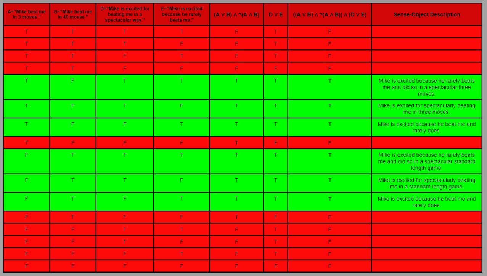

# Sense and Truth - WORK IN PROGRESS 
#### Andrew Ribeiro 
#### May 2020

> Suppose Professor Hardy came to me and said, "Wittgenstein, I've made a great discovery. I've found that..." I would say, "I am not a mathematician, and therefore I won't be surprised at what you say. For **I cannot know what you mean until I know how you've found it.**" We have no right to be surprised at what he tells us. For although he speaks English, yet the meaning of what he says depends upon what he says depends upon the calculations he has made. 
>
>-Wittgenstein's Lectures on The Foundations of Mathematics (Cambridge 1939)

In some sense of the word, we may say that *truth* is simply what is the case. To *know* what is the case, i.e., the state of the world, we must also know *how* something is the case. For example, if I said to you "I am sick," you would need to know what sickness I have in order to understand what my words *mean*, i.e., the state of affairs which make "I am sick" true. The set of circumstances which make a proposition true is the *sense* of a proposition, and a particular circumstance is a *sense-object*. "I have the flu." is an example of a sense-object belonging to the sense of the "I am sick." proposition. 

The *impression* of a sense-object, i.e., the phenomenological representation of a sense-object, is relative to all objects contained by the sense it belongs to. For example, "I have cancer." and "I have the flu." are both sense-objects belonging to the sense of the proposition "I am sick." Thus, the fact that we could have cancer dampens the impression of having the flu because cancer expands the scale of sickness and makes the flu appear to be a rather minor illness by comparison. 

Of course, every proposition belongs to a context which *augments* its sense. If "I am sick." is said by a 90-year-old woman, then the "I have the flu." and "I have cancer." may have the same impression, i.e., the signification of imminent death. 

I am of the opinion that *truth* has deleteriously overshadowed the significance of *sense* throughout much philosophical discourse. Many philosophers have waged countless battles over *the* truth, but in many cases, they were actually clashing over their *sense* of the truth. Can much of philosophy be reduced to an affirmation of the fact that the appearance of an object is a function of one's orientation to it? 

In this essay, I will further examine the relation between sense and truth. 

## Sense, Space, Object, and Reason
> All our knowledge begins with the senses, proceeds then to the understanding, and ends with reason. There is nothing higher than reason. 
>
>-Immanuel Kant

Our five basic senses are like sensors which allow us to detect objects in different spaces; for example, when we smell something, we detect a particular *scent object* in the *space of scents*. Scent objects do not exist in the same space as *tactile objects*, so it is strictly nonsensical to ask something like "How does the smell of chocolate compare with a gentle stroke across your cheek?", but it is perfectly sensible to ask something like "How does the smell of chocolate compare with the smell of vanilla?" What distinguishes nonsensical statements from sensible statements? 

When comparing objects within the same sensory space, i.e., sense, we must represent them as coordinates with respect to particular distinguishable axes in that space; for example, "sweet" is a word we use to describe certain types of scents, thus we may *embed* scent objects in a 1D space of sweet scents. 

<figure class="image">
  
  <figcaption>Figure 1: An embedding of three scent objects in the 1D sweet scents space.</figcaption>  
</figure>

In *figure 1*, I have *embedded* three scent objects in the 1D sweet scents space, namely: celery, chocolate, and vanilla. I am unacquainted with the science of scent, so my embedding should not be considered rigorous or objective; what I provide here is purely for the sake of discussion. To my nose, celery does not smell sweet at all and vanilla smells sweeter than chocolate. We may now increase the dimensionality of the embedding space by adding another axis. We will choose the "nutty" smell for this purpose.  

<figure class="image">
  
  <figcaption>Figure 2: An embedding of three scent objects in the 2D sweet-nutty scent space.</figcaption>  
</figure>

When we embed objects in a space, we reason about where each object is placed with respect to the other objects in the embedding. To make the embedding depicted by *figure 2*, I started off by placing chocolate and vanilla where I thought they should be, then I began reasoning about where to place celery. I associate nutty with dark heavy smells like wood and chocolate, thus light floral smells would be the opposite of nutty. Therefore, celery should be closer to vanilla than chocolate on the nutty axis, but how much closer? Celery has a somewhat earthy smell, so it shouldn't be right next to vanilla, but perhaps somewhere between chocolate and vanilla. If we feel that celery has no relation to the nutty scent at all, we would put celery in the center of the nutty axis. Again, my embeddings are subjective and I am merely providing my reasoning to illustrate the *proximity reasoning* one performs when embedding objects in a space. 

The objects I have chosen above to represent scents are not *pure* in the sense that they are not disembodied scent objects: the vanilla ice cream, the celery sticks, and the chocolate ice cream can all be projected into other senses, i.e., we can touch, see, feel, smell, and hear these objects. The basis of how we identity these objects is how they stand in relation to each of our senses. If we lick the chocolate ice cream and find that it has the texture of stone, we would feel deceived in the sense of texture; if we take a bite of the celery stick and find that it makes a soft wet sound, like biting into ice cream, yet feels stiff like it should, we would feel deceived in the sense of hearing; if we lick the chocolate ice cream and it tastes like vanilla, we would be deceived in the sense of taste; and so on.

How an object stands as represented by our senses is only the beginning of the life of an object in the mind. If we ate one hundred pounds of ice cream and felt as if we ate nothing, we would feel deceived in the *sense of reason*. Given that on average a pound of ice cream is one thousand calories, one hundred pounds of ice cream would be enough calories to sustain a man for forty days or so! Eating ice cream before dinner may also irritate our reason in a different way. Reason can be said to be a type of *super sense*. 
With reason, we can create *senses*, i.e., spaces in which we can represent and reason about objects beyond what the basic senses offer us. 

In the case of food, we can use reason to construct the *caloric sense*. Just like we embedded objects above in the space of scent, we can do the same for calories. 

<figure class="image">
  
  <figcaption>Figure 3: Three objects embedded in the 1D 1 oz calories space.</figcaption>  
</figure>

We can also use reason to construct the *dinner food sense*.

<figure class="image">
  
  <figcaption>Figure 4: Three objects embedded in dinner food sense.</figcaption>  
</figure>

We use reason to construct senses, i.e., spaces, and objects, i.e., named regions of space. As an example, suppose we are given the following statements: 
- **C**="I have consumed 2,500 calories today. I have therefore met the average daily caloric intake recommendation."
- **D**="I have consumed 1,500 calories today. I have therefore not met the average daily caloric intake recommendation."
- **B**="Eat a 150 calorie ice cream cone as a snack."  

**C** and **D** are spaces which can contain the object **B**. If **B** is contained by **C**, then it is an object of overindulgence in the *caloric sense*. On the other hand, if **B** is contained by **D**, then it is not an object of overindulgence in the *caloric sense*, but may be one in the *nutritional sense*.  **C** and **D** are *contextual senses*, meaning that they can contain objects like **B**, i.e., give sense to actions. **B** is not a sense: it cannot contain objects. 

By itself, **B** is nonsense: what does **B** *mean* without a context that allows us to make sense of it? It may be tempting to say **B** makes perfect sense without a context, i.e., it is an object that can been understood 

These musings are somewhat superficial, 

## The Midnight Call
Your phone rings in the middle of the night. You are startled awake and pick up the phone. It's a doctor from your local hospital: **A**="Your son has been injured.", he says. You have no reason to believe the doctor is an impostor or lying and so your emotions begin to swirl as your mind fluctuates over various probability assignments to different types of circumstances which may make **A** true: did he drown, did he fall off his bike, was he attacked by someone, etc. 

<figure class="image">
  
  <figcaption>Figure 1: An incomplete <i>shape</i>, i.e., <i>sense</i>, of proposition <b>A</b> discussed above. </figcaption>  
</figure>

As depicted in figure 1, the truth of a proposition alone does not necessarily imply a singular state of affairs. On the contrary, it delimits a *space of affairs*, which we may call the *sense* of a proposition. 

If the doctor in the phone call above continued to speak and told you that your son's finger was broken by him slamming the fridge door on it while retrieving items for a midnight snack, the *impression* that this *particular* injury would make on you is relative to all other objects contained in the sense of being notified that your son was injured in the middle of the night. Namely, you would be relieved and would most likely find the situation comical because being notified of such an injury at midnight is somewhat absurd when contrasted with the other objects contained in the sense of being notified of an injury at midnight -- like having a heart attack.

Naturally, the context of a proposition augments its sense. Being notified of your son being injured in the middle of the night has a much *graver* sense than being notified in the middle of the day. Even though they have a similar *coverage* of objects they contain, i.e., the time of day does not *cause* certain types of injuries, the *probability* of each object making the proposition true is different; for example, it is more likely to be notified in the middle of the night that your son has suffered a heart attack or some domestic injury, as opposed to being notified that he was attacked while walking the streets, which is unusual behavior for most people. 

<figure class="image">
  
  <figcaption>Figure 2: The sense and impressions of getting notified of your son's injury at midnight.</figcaption>
</figure>

*Figure 2* is an incomplete picture of the sense and impressions of being notified at midnight that your son has been injured. Eight particular circumstances which make the proposition "Your son has been injured." true, which we may call *sense objects*, are taken to cover the *entire* sense of the proposition. This is obviously not a realistic rendering, but it is enough to provide a simple model for discussion. Each sense object is projected into two domains: the probability domain and the weight domain. Each domain can be considered to be a probability distribution, i.e., the real number assigned to all events in the domain sum to one. This is depicted by a fixed sized rectangle which is divided up between the probability, or weight, of each event. The weight of having a heart attack, drowning in a bathtub, falling off a cliff, etc., are all the same because they indicate the death of your son; however, their probabilities are different. Therefore, even though the weight of your son drowning or him having a heart attack may be the same, in the sense that they both signify his death, the *impression* they make on you within the context of being notified of him being injured at midnight is different because the probability of each sense object is vastly different. I should perhaps note that the particular weight and probabilities depicted in *figure 2* are obviously not fixed as I have portrayed them: each individual has their own probability map and weight map of sense objects contained by the sense of any given proposition which informs their impression of sense objects.   

## The Chess Game
> A point in space is an argument place. 
>
>-Ludwig Wittgenstein, Proposition 2.0131 of "Tractatus Logicus Philosophicus"

Suppose I said to you "Mike beat me in a game of chess.", do you know *what* I mean or do you know what I *could* mean? One can win a game of chess in many ways: saying that Mike beat me does not say *how* he beat me. If I continued and said "He was very excited about it." do you know what this means or what it could mean? What am I saying with such vague statements? 

1. "Mike beat me in a game of chess."
2. "He was very excited about it."

The sense of proposition *(1)* does not share the same sense as proposition *(2)*. What makes Mike win the game of chess is not what makes him excited about it; although, his excitement may be a *function* of the state of affairs which make him win. For example, suppose Mike beat me in three moves. He may be excited because beating an opponent in such few moves is rare and impressive, but these qualities driving his excitement for winning are meta-game characteristics, i.e., the rules of chess say nothing about rarity or impressive games. We can also consider the case where Mike is excited to win because he rarely beats me. This sense-object of *(2)* is obviously not contained by the sense of *(1)* because Mike winning a game is *independent* of his frequency of winning against me. In simple terms: *(1)* and *(2)* are made true by different information. 

To make this scenario accessible for analysis, we will reduce *(1)* to *(1')*: $(A ∨ B) ∧ ¬(A ∧ B)$. Where A = "Mike beat me in 3 moves." and B = "Mike beat me in 40 moves."  

<figure class="image">
  
  <figcaption>Figure x: Truth table of <i>(1')</i>.</figcaption>
</figure>

We will also simplify *(2)* to *(2')*: $D ∨ E$. Where D = "Mike is excited for beating me in a spectacular way." and E = "Mike is excited because he rarely beats me."

<figure class="image">
  
  <figcaption>Figure x: Truth table of <i>(2')</i>.</figcaption>
</figure>

When we say *(1)* and then *(2)*, we concatenate the sentences: "Mike beat me in a game of chess. He was very excited about it." Similarly, when we say *(1')* and then *(2')*, we use the *and* logical connective to join them: $((A ∨ B) ∧ ¬(A ∧ B)) ∧ (D ∨ E)$. In words this says: "Mike beat me in 3 moves or he beat me in 40 moves, but he did not beat me in both 40 moves and 3 moves, and he is exited for beating me in a spectacular way or he is excited because he rarely beats me." 

<figure class="image">
  
  <figcaption>Figure x: Truth table of <i>(1')</i> ∧ <i>(2')</i>.</figcaption>
</figure>

