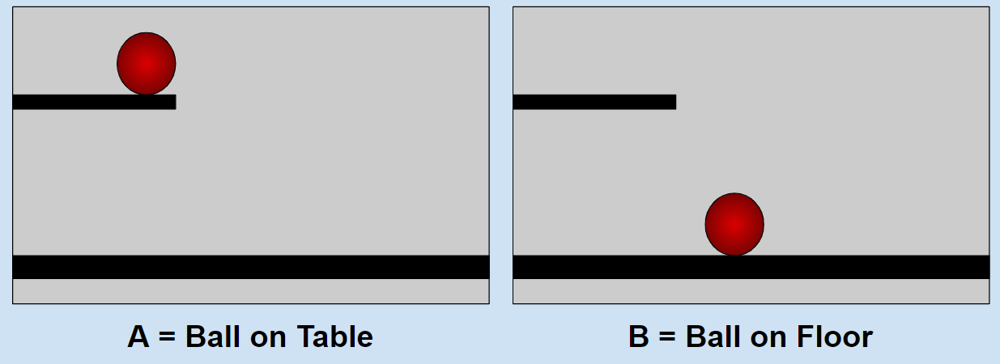
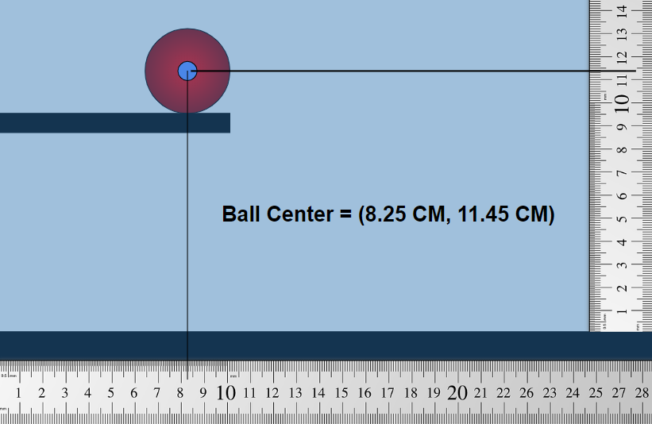

# The Pursuit of Principles - WORK IN PROGRESS
#### Andrew Ribeiro 
#### May 2020

> Indeed, I often wondered why, as far as the recorded history of mankind extends, no mortal had [attempted to assign to all things a characteristic number and thereby reduce reason to a form of arithmetic], for meditations of this kind ought to be among the first to occur to those **reasoning in the proper order**, just as they occurred to me. I came to this discovery while still a youth, for the sole reason that **I always searched for first principles**. The real reason why people have missed the doorway [into this discovery], is, I think, because principles are, for the most part, dry and insufficiently agreeable to people, and so, **barely tasted**, they are dismissed." 
>
>-G.W. Leibniz, "Preface to a Universal Characteristic" (1678-79)

If we equate philosophy with "the pursuit of truth," then it follows that the methods by which we pursue truth should be the primary objects of our studies. If our task was to circumnavigate the globe, setting off on foot wouldn't be a sufficient course of action because we'd never complete our task with such meager means of transportation; it is thus necessary to first study the ways in which man may traverse the earth and thereby develop a method which allows us to complete our journey. The same reasoning can be applied to the pursuit of truth: we are in dire need of methods which assist our minds in traversing the space of truth.

## Mysticism, Principles, and Demonstrable Knowledge 

For much of history, man has been lead astray from the pursuit of truth by various kinds of *mysticism*. All mysticism can be characterized by a lack of *demonstrations*. An example of a *mystical proposition* is: "Putting salt around the windows and doors of your house keeps bad spirits out." The *truth* of such mystical propositions are said to be derived from higher planes of knowledge, or entities which gift such knowledge, and therefore only intersect this world through conduits of supernatural individuals, i.e., mystics; hence, we cannot possibly prove mystical propositions by worldly demonstrations because they are not of this world... so say the mystics.

Without a mechanism of ensuring that man is in fact traversing the realm of truth, it is easy for him to lose himself in fantastical mythos. Adding the constraint that knowledge must be demonstrable, either by experiment or deduction from first principles, changes the entire character of the pursuit of truth because it greatly constrains what constitutes truth, i.e., truth becomes *that which can be demonstrated*. 

As I discuss in ["Truth, Construction, and Confusion,"](truth_construction_confusion.md) principles can be considered to be that which forms the basis of *constructive systems*; for example, suppose you witness a girl slap a boy. You may say this situation is a demonstration, i.e., construction, of the principle of anger. Principles are revealed by demonstrations, i.e., constructions, which encompass the *sense* of principles; without demonstrations, principles are nonsensical, i.e., we can *barely taste* them. For example, the theorems of Euclidean geometry form the *sense* of Euclidean geometry, i.e., they are elucidations of the principles, i.e., the axioms and postulates, of Euclidean geometry.

Under the constraint of demonstrable knowledge, the pursuit of truth becomes the pursuit of principles. This poses a significant problem: given that principles are nonsensical in the absence of demonstrations, how does one discover that which is nonsensical? Luckily for us, the universe naturally nourishes us with many demonstrations, from which we can induce the many principles governing the phenomena of our world. In modern science, the *principle discovery pipeline* is often long and far removed from actual observations; for example, Faraday's experimental studies of electromagnetism lead to Maxwell's mathematical formulation of electrodynamics, which gave rise to asymmetries that [piqued the curiosity of Einstein](papers/Einstein_1905_relativity.pdf), which then consequently lead to Einstein's discovery of relativity. 

Our ability to reason about abstract models expands upon what we can *directly* learn from the world. We build models that account for the *descriptive aspects* of phenomena and by doing so, we reveal *non-descriptive aspects* of phenomena. The space-time continuum could not have been discovered without the use of mathematics because it is itself a *byproduct* of Einstein's mathematical modeling of general relativity. Therefore, we can only say that the space-time continuum is a non-descriptive aspect of a particular phenomenon which accounts for its descriptive aspects. 

In the case of a more commonplace example, suppose we observe a woman yelling at a man. If we describe the physical act of the woman yelling at a man, we would not use the word "anger" because it is not contained in the description of the physical phenomenon, but rather it is a non-descriptive aspect of the phenomenon, i.e., it belongs to our model, i.e., perception, of it. This is an important distinction because conflating our models of the phenomena with our descriptions of them often lead to significant errors; for example, we may find upon further investigation that the man and woman were just joking. Thus, we should always be mindful that non-descriptive aspects of phenomena, i.e., models which account for the descriptive aspects of phenomena, are not intrinsic to phenomena. 

Suppose a ball is on the edge of a table. I could describe two states of the ball: $A =$ "ball on table" and $B =$ "ball on floor". 

<figure class="image">
  
  <figcaption>Figure 1: A ball on the table and a ball on the floor.</figcaption>  
</figure>

<figure class="image">
  
  <figcaption>Figure 2: A ball on a ledge with a quantification layer.</figcaption>  
</figure>

Demonstrable knowledge can be said to be a type of *theory of descriptions*. 
In the case of the natural world, **demonstrable knowledge* means a function, or system of producing such functions, which maps descriptions to future descriptions.

The power of mathematics lies in its ability to acutely describe phenomena via quantification.  

Newtonian physics takes this a step further by using numbers to describe physical objects and then provides a system of producing functions which mathematically model the relation between numerical descriptions with respect to time. 

## The Problem of Black Boxes 

Not all objects offer themselves so freely to description. How does one *describe* the phenomenon of love? Something happens within us