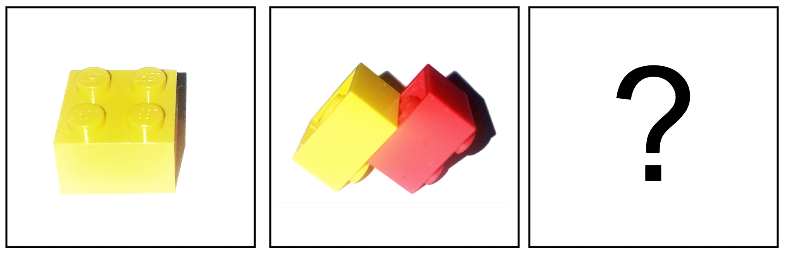

# Truth, Construction, and Confusion
#### Andrew Ribeiro 
#### May 2020

<audio controls="controls">
  <source type="audio/mp3" src="audio/truth.mp3"></source>
  
Your browser does not support the audio element.

</audio>

> Philosophy is a battle against the bewitchment of our intelligence by means of language. 
> 
>-Ludwig Wittgenstein, "Philosophical Investigations" 

What *is* truth? 

Questions such as these are always doomed for failure: they are *confused* questions. Are we asked us to enumerate all truths or are we asked to define some murky abstract object which captures the *Idea* of all truths, i.e., the *form* of truth? A great question for debate is which sense of the question is more absurd? That all truths are enumerable or that truth has a singular form?

Of course, when people ask such questions without wincing from their obvious absurdity, they feel emboldened to *dare* asking them because words such as "truth" are often recklessly used in common language. The line of reasoning is: if "truth" is used so much in common language, then surely it *means* something important. To the common man, "truth" often means a state of affairs which satisfies him. To the learned man, "truth" often means that which can be demonstrated. And to others such as myself, "truth" means what it means to the common man and to the learned man, i.e., we understand it to be a confused catch-all term for many things.

Aside from the strict philosophical concerns which emerge from the linguistic conundrums posed by the word "truth," we can speculate as to why it is a term of great interest. No one has ever made a similar fuss about words like "nutmeg," so "truth" must *capture* something much more significant than ordinary words. As humans whose lives depend on making decisions based on our understanding of the world, having an accurate understanding of the world is of the utmost importance because if our understanding does not reflect the world as it is, then our decisions may lead to disastrous outcomes. In this sense, "truth" is used to signify an accurate reflection of the world which may serve as the foundation for sound decision making. 

The theorems of Euclidean geometry, like how to construct the midpoint of a line segment, are deduced from a set of axioms and postulates. There are two ways of invalidating the truth of a theorem: show that the axioms and postulates used in deducing a theorem are false or show that the system of logic used in deducing a theorem is invalid. Every axiomatic system has what amounts to a set of atoms, i.e., indivisible units, i.e., axioms, and a chemical law, i.e., how indivisible units can be joined together to make more complicated structures, i.e., how theorems can be proven. 

Consider the case of these three LEGOs: 

<figure class="image">
  
  <figcaption>Figure 1: The three-lego system. </figcaption>  
</figure>

These three legos can be considered the axioms, i.e., indivisible units, of an axiomatic system that we may call the *three-lego system*. The logic of this system, i.e., the mechanics of using the three legos to construct composite structures, is represented physically by studs on the top of lego pieces and holes on their bottoms. An example of a three-lego theorem is: 

<figure class="image">
  
  <figcaption>Figure 2: A three-lego theorem.</figcaption>  
</figure>

How do we know this is a three-lego theorem? We prove it: 

<figure class="image">
  
  <figcaption>Figure 3: Proof of the theorem in figure 2.</figcaption>  
</figure>

Of course, proof in this case is synonymous with construction: a three-lego theorem states that a particular three-lego object can be constructed and its proof is a demonstration of its construction. If we posit that an object can be constructed, but provide no proof, then we have asserted a *conjecture*. If we can prove a conjecture, then it is a theorem. Consider this three-lego conjecture: 

<figure class="image">
  
  <figcaption>Figure 4: A three-lego conjecture.</figcaption>  
</figure>

Doesn't look quite right does it, but let's try to prove it:

<figure class="image">
  
  <figcaption>Figure 5: Attempting to prove the conjecture depicted in figure 4.</figcaption>  
</figure>

We can construct *part* of the proof, but we cannot affix the blue block to the yellow and red block in a way that constructs the conjecture stated above because it violates the logic of the three-lego system, i.e., no hub of the blue block is inserted into a hole of the red or yellow block. Thus, the three-lego conjecture stated above is not a theorem because it is *illogical*, i.e., it does not abide by the rules of LEGO construction. 

Now we must ask: what is the relation between the nature of truth in the domain of axiomatic systems, as exemplified by Euclidean geometry and the three-lego system, and in our lives? 

Suppose you have three beliefs: your local grocery store is open from 9 AM to 10 PM, it takes 10 minutes to drive there, and they are always in stock of the items you are looking for. Now, let's say that it is 9:30 PM and you have run out of milk that accompanies your typical nightly snack. Given your beliefs, "I can go to the grocery store and pick up a carton of milk." is a theorem. The proof is as follows: it is 9:30 PM, it takes 10 minutes to drive to the store, thus you can make it to the store by 9:40 PM, which is twenty minutes before closing, and since they always have the items you are looking for, you can buy a carton of milk. If any of your beliefs are invalidated, so will your theorem be. If the store actually closes at 9 PM instead of 10 PM as you believe, you will find locked doors when you arrive. If you get into a car accident, then it will most likely take more than 10 minutes to get there. If you were wrong about the store always having stock of the item you are looking for, you may make it to the store when they are still open, but fail to buy a carton of milk because they are out of stock. Within your model model of the world, i.e., your set of beliefs about the world and the inferences you make upon them, there are only three points of failure because there are three beliefs which may be invalidated by the world. Now, suppose you made it to the store, grabbed a carton of milk, but then realized at the cash register that you had forgotten your wallet at home. This type of failure was not accounted for in your model of the world and will come as an even greater surprise than any invalidation of your beliefs because it comes from *outside* your model of the world. 

We construct our reality upon the foundation of our beliefs, just like we construct theorems upon the foundation of various sets of axioms in mathematics. From this point of view, truth is any foundation upon which objects can be constructed. When we are speaking about objects of our reality, truth means that our mental model of the world reflects the world as it is, i.e., any mental construction we make upon what we call truth should allow us to perform the physical equivalent of said mental construction; for example, if we mentally construct a *grocery store milk run theorem*, we should be able to actually perform the action in the world if our mental model of the world is true. 

We may now be tempted to say that theorems are truths, but the truth of every theorem is *contained* in the axioms it is constructed upon: if an axiom is invalidated, so is the theorem. Truths are self-contained: they are not derived from anything else. Theorems may be called *extensions* of truth, but they are not truth in themselves. This line of reasoning gives us another way of describing truth: truth is that which is indivisible. 

Speaking of truth in the abstract can only get us so far. What follows are two scenarios which illustrate how what we call "truth" is far more illusive than the concreteness of the word would have us believe. 

## The Robbery
A bank was robbed. All eyewitnesses reported the same story: a lone gunman entered the bank, demanded that money be put in a bag, and then drove away in a van. Who robbed the bank? 

The police eventually find the gunman, named Mr. X, and he tells them that he was forced to rob the bank because a man named Mr. Y took his family hostage and threatened to kill them unless he robbed a bank and gave the money to Mr. Y. The police find indisputable evidence that Mr. X is telling the truth. Now we ask again: who robbed the bank? Mr. X or Mr. Y? 

It is undisputed that Mr. X performed the act of physically taking money from the bank, but he was coerced into doing so by Mr. Y. Thus, the propositions "Mr. Y robbed the bank." and "Mr. X robbed the bank." are both true in different *senses* of the question "Who robbed the bank?". If we simply equate "robbed" with the physical act of forcefully taking money from a bank, then Mr. X robbed the bank. In the more rigorous case of law, Mr. Y would be, in most nations, charged with the *crime* of robbing the bank and Mr. X would be exculpated. Intention is at the heart of the matter here. Mr. X did not rob the bank with the *intention* of keeping the money for himself, he did so with the intention of saving his family. Thus, the act of robbing the bank was an act of saving his family for Mr. X, not an act of robbery per se. The intention of robbery lies with Mr. Y, hence we may say that it was he who robbed the bank. 

The question "Who robbed the bank?" may be asked under varying motivations, each of which expects different answers. When the police arrived on the scene of the crime, they would have been primarily interested in finding the gunman. Thus, initially, the question "Who robbed the bank?" was really the question "Who was the gunman?". After the police found Mr. X and the evidence implicating Mr. Y, the question "Who robbed the bank?" became "Who is *accountable* for robbing the bank?". Therefore, the question is polymorphic: although it may be asked with the same words, the context in which it is asked changes its meaning, i.e., transforms it into a different question

This scenario illustrates the difficulty of divorcing the state of the world and our interpretation of it. The state of the world requires a *representation* to be expressed and there are often multiple representations, i.e., interpretations, for the same truth! When we attempted to represent the truth of the bank robbery, we found that there were two competing representations: the intentional representation, i.e., who is guilty for the bank robbery, and a material representation, i.e., who actually committed the physical act of robbing the bank. Truth is bound to how we use it, i.e., truth can only be known through some representation which is useful in some context. 

## A Strange Man
A strange man is roaming the streets: the meaning of left and right is swapped in his mind. If you tell him to go "left" he will go right, and vice versa. 

He is lost and asks a stranger for directions. The stranger says: "Go down the street and make make a left." The man thanks the stranger and heads down the street. Just when he is out of shouting distance, the stranger remembers that he is mistaken: the man must go right, not left! When the man reaches the end of the street, he makes a right because he is a *strange* man that always goes right instead of going left, and he finds his destination just as the stranger said he would. 

The stranger believes he told a lie, but the man believes the stranger told him the truth because following the stranger's instructions did what he said they would. Who is right? Did the stranger tell a lie or did he tell the truth? 

Within the stranger's frame of reference, where "left" is left and "right" is right, his directions are a lie in the sense that if *he* followed his *own* directions, he would not end up in the right place. On the other hand, within the strange man's frame of reference, where "left" is right and "right" is left, the stranger's directions are truthful in the sense that they lead him to the right place. 

This scenario illustrates the role of frames of reference in asserting propositions. The word "left" isn't a biological dictate: when one says "left," the brain does not turn left like a machine executing a subroutine. It is a symbolic word and all symbols are empty: they only represent what we allow them to represent. Nothing prohibits us from using the word "left" to refer to elephants. We could *rebind* all of our words to different objects if we wished, but we don't wish for such things because no one else could understand our *private* version of English. Thus, in order to evaluate a proposition, we must clarify what the symbols refer to. Since the stranger and the man didn't exchange a *symbolic codex*, the symbols used in the proposition were not explicitly agreed upon. Of course, dictionaries and culture are the latent symbolic codex we assume everyone is using because otherwise language would be far too inefficient if we had to review what our words reference in every interaction, but every now and then we do cross paths with a person like the strange man whose symbolic codex is different from our own. This poses a great problem: how can we reach the truth of a matter when we may be speaking of different things under the same symbols? 