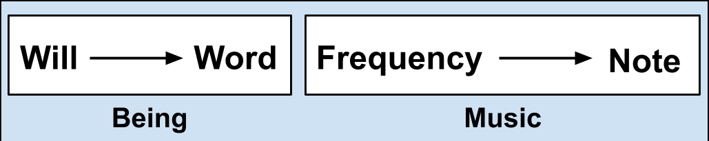
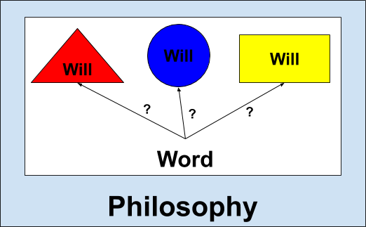

# Will and Word - WORK IN PROGRESS 
#### Andrew Ribeiro 
#### June 2020

> **Miranda to Caliban:** Abhorrèd slave, 
Which any print of goodness wilt not take, 
Being capable of all ill! I pitied thee, 
Took pains to make thee speak, taught thee each hour 
One thing or other. When thou didst not, savage, 
Know thine own meaning, but wouldst gabble like 
A thing most brutish, I endowed thy purposes 
With words that made them known. But thy vile race, 
Though thou didst learn, had that in ’t which good natures 
Could not abide to be with. Therefore wast thou 
Deservedly confined into this rock, 
Who hadst deserved more than a prison.
>
>-Shakespeare, Act 1 Scene 2 of "The Tempest"

What would man be without language? What would language be without words? What would words be without will? What would will be without being? What would being be without world? What would world be without God? 

In this entry, I will reflect on the relation between will and word. 

## Section 1: Symbols, Construction, Will, and Philosophy

Are we not confounded by the multitude of our being? In the domain of music, we reduce the *continuum of frequency* to the *symbolic space of notes* in order to make the act of composition tractable. Likewise, in the domain of being, we reduce the *continuum of will* to the *symbolic space of words* in order to make the act of communication tractable. Words empower the composition of thought like notes empower the composition of music.

<figure class="image">
  
  <figcaption>Figure 1: Symbolic associations in the domains of being and music </figcaption>  
</figure>

Why do we not have a word for "a cold cup of soup on the moon?" In the context of an ordinary life, one is not compelled to reference "a cold cup of soup on the moon" very often and hence there is no utility in creating such a word. Words give form to will: where there is no will, there is no word. 

> Philosophy is a battle against the bewitchment of our intelligence by means of language.
>
>-Wittgenstein, "Philosophical Investigations" 

Words are a mixed blessing. On the one hand, words allow us to organize ourselves for the purpose of communication, but on the other hand, the concreteness of words tends to perplex us even further by leading us to falsely believe we have a firm grasp of our will. "Philosophy" is the word for the process of compensating for the inadequacy of language, introduced by the lossy symbolic association of will to word, in precisely representing our will.

<figure class="image">
  
  <figcaption>Figure 2: Philosophy as the interrogation of symbolic associations performed in the domain of language. </figcaption>  
</figure>

Many philosophers argue that words have objective will-forms. Their arguments rest on how they communicate about the world and what will-forms are useful for constructing representations of their will. For example, to some men, the word "love" is nonsense because they see it as a vain ideal which mythologizes hormonal behavior, but to the romantics among us, it is a significant word that they deem indispensable for the comprehension of life. With this understanding in mind, it is no wonder why so many philosophers are at odds with each other: a philosopher's philosophy is a representation of the will bound to their being and cannot be reconciled with the philosophy of a philosopher who is of a fundamentally different constitution. 

Particular philosophies used to guide the cultivation of men produce specimens suited for different tasks. For example, the philosophy of the Christianity does not assist in the creation of scientific minds, but the skepticism of Descartes does. Philosophy is used for shaping the will bound to words. We use words to represent our will, i.e., communicate. Therefore, our philosophy governs the types of thoughts we can construct. The types of thoughts we wish to construct is governed by the will bound to our being and thus the nature of our attraction to philosophies is governed by our affinity with the being of the philosophers that produced them. The way in which we appreciate philosophy is no different than the way in which we appreciate music. 

## Section 2: The Binding of Will to Word
